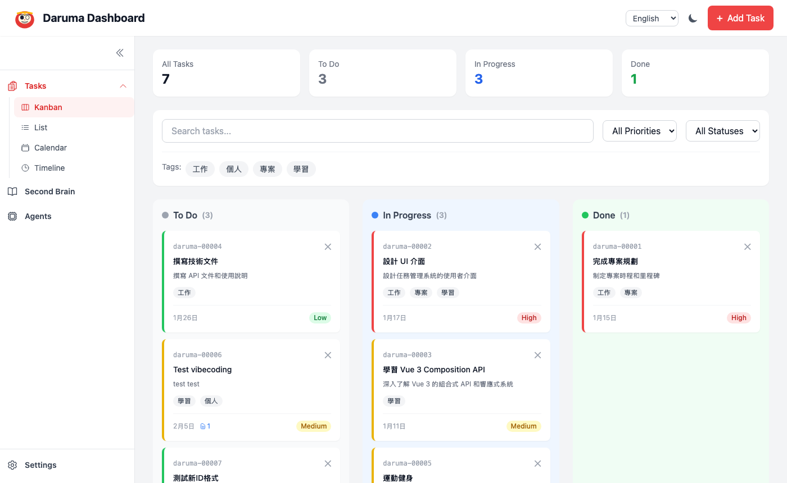
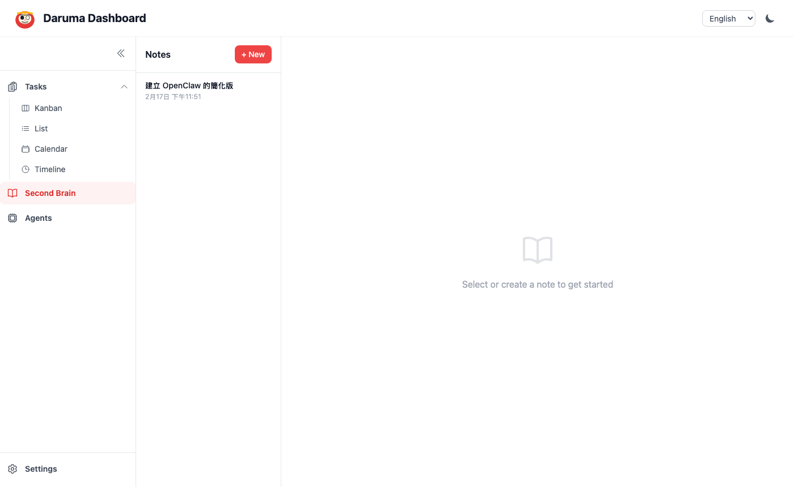
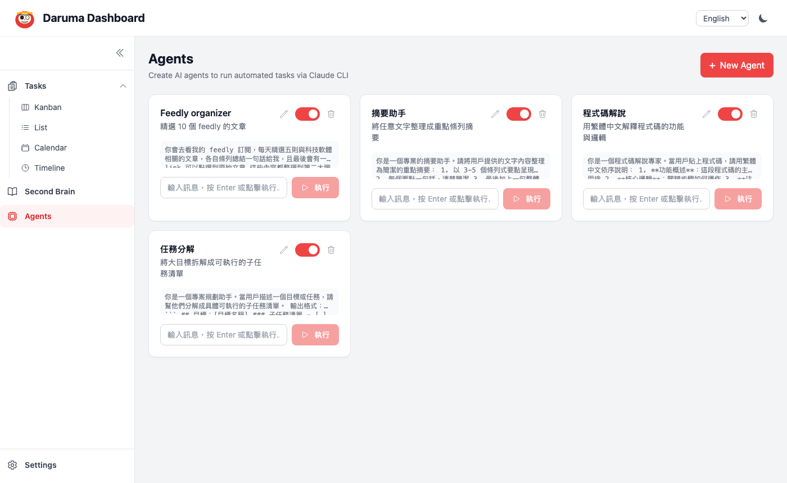
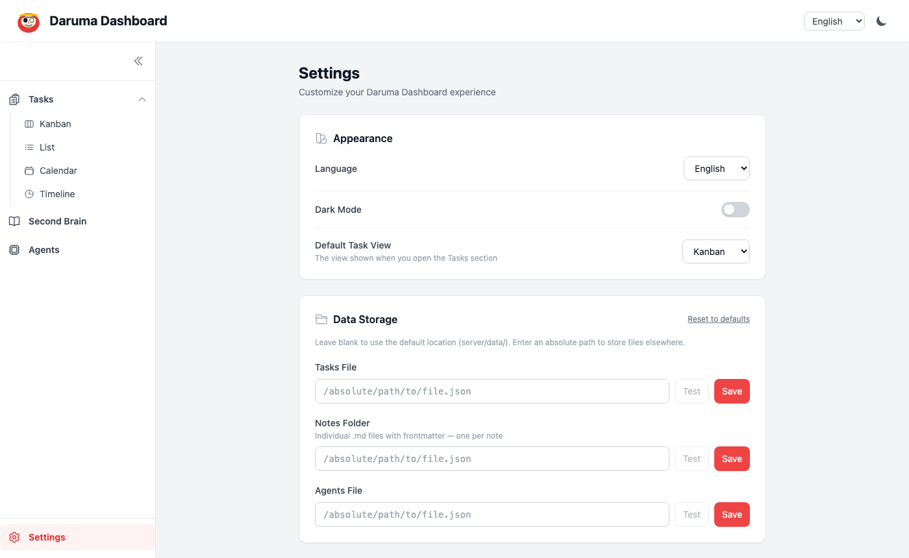

# Daruma Dashboard

> A local-first personal management tool built with **Vue 3 + Express**, featuring three integrated modules: Task Manager, Second Brain (notes), and AI Agent runner.

**README also available in:** [繁體中文](README.zh-TW.md) · [日本語](README.ja.md)

---

## Screenshots

### Task Manager — Kanban View


### Second Brain — Markdown Notes


### AI Agents


### Settings


---

## Features

### Task Manager
- Four views: **Kanban**, **List**, **Calendar**, **Timeline**
- Priority, status, tags, and date ranges per task
- Drag-and-drop between Kanban columns
- Advanced filters: search, priority, status, tags

### Second Brain (Notes)
- Each note saved as an individual **`.md` file** (with YAML frontmatter)
- Markdown editor with one-click preview toggle
- Configurable auto-save delay (default 800ms)
- Bidirectional task ↔ note linking
- Note backlink badges on task cards; click to navigate

### AI Agents
- Create agents with custom System Prompts
- Runs locally via `claude --print` CLI (configurable timeout)
- Enable/disable toggle, inline edit settings
- Built-in examples: Summarizer, Code Explainer, Task Decomposer

### Settings
- Configurable storage paths for tasks, notes folder, and agents
- Appearance: language, dark mode, default task view
- Editor: auto-save delay, default mode (edit / preview)
- Agent runner: execution timeout
- In-app documentation and keyboard shortcuts reference
- [GitHub repository link](https://github.com/JamesBubu/Daruma_Time_Management)

---

## Architecture

```
┌─────────────────────────────────────────────┐
│  Header  (language / dark mode / add task)  │
├──────────┬──────────────────────────────────┤
│          │  Tasks  → Kanban / List /         │
│ Sidebar  │           Calendar / Timeline     │
│ 60–240px │  Second Brain → Markdown notes    │
│          │  Agents → Claude CLI runner       │
│          │  Settings → storage / prefs       │
└──────────┴──────────────────────────────────┘
```

| Layer | Technology |
|-------|-----------|
| Frontend | Vue 3 (Composition API) + Pinia + Tailwind CSS |
| Calendar | FullCalendar v6 |
| Markdown | marked v12 |
| Icons | @heroicons/vue |
| Backend | Express.js (ESM) |
| Storage | Local files — JSON for tasks/agents, `.md` files for notes |
| AI | Claude Code CLI (`claude --print`) |

---

## Getting Started

### Prerequisites
- Node.js 18+
- [Claude Code CLI](https://claude.ai/code) installed and authenticated *(for Agent feature)*

### Installation

```bash
# 1. Clone the repository
git clone https://github.com/JamesBubu/Daruma_Time_Management.git
cd Daruma_Time_Management

# 2. Initialize local data files (kept out of git)
cp server/data/tasks.example.json  server/data/tasks.json
cp server/data/agents.example.json server/data/agents.json
# Notes are stored as .md files in server/data/notes/ — created automatically

# 3. Install dependencies
cd server && npm install && cd ..
cd client && npm install && cd ..
```

### Start

```bash
# Terminal 1 — Backend (port 3001)
cd server && npm run dev

# Terminal 2 — Frontend (port 5173)
cd client && npm run dev
```

Open **http://localhost:5173** in your browser.

---

## Data & Privacy

Personal data is stored locally and listed in `.gitignore` — it is **never committed to git**.

```
server/data/
├── tasks.json          ← your tasks     (local only)
├── notes/              ← your notes     (local only, one .md file per note)
│   ├── note-00001.md
│   └── note-00002.md
├── agents.json         ← your agents   (local only)
├── tasks.example.json  ← empty template (committed)
└── agents.example.json ← empty template (committed)
```

Each note file uses YAML frontmatter:

```markdown
---
id: note-00001
title: My Note
linkedTasks: ["task-00001"]
createdAt: 2025-01-01T00:00:00.000Z
updatedAt: 2025-01-02T00:00:00.000Z
---

# My Note

Write your markdown content here...
```

You can move the notes folder anywhere by setting a custom path in **Settings → Data Storage**.

---

## API Reference

### Tasks
| Method | Path | Description |
|--------|------|-------------|
| GET | `/api/tasks` | List all tasks |
| POST | `/api/tasks` | Create task |
| PUT | `/api/tasks/:id` | Update task |
| DELETE | `/api/tasks/:id` | Delete task |
| GET | `/api/tags` | List all tags |
| POST | `/api/tags` | Add a tag |

### Notes
| Method | Path | Description |
|--------|------|-------------|
| GET | `/api/notes` | List all notes |
| POST | `/api/notes` | Create note |
| PUT | `/api/notes/:id` | Update note |
| DELETE | `/api/notes/:id` | Delete note (clears backlinks) |
| POST | `/api/notes/:id/link-task` | Link note ↔ task |
| DELETE | `/api/notes/:id/link-task/:taskId` | Unlink |

### Agents
| Method | Path | Description |
|--------|------|-------------|
| GET | `/api/agents` | List all agents |
| POST | `/api/agents` | Create agent |
| PUT | `/api/agents/:id` | Update agent |
| DELETE | `/api/agents/:id` | Delete agent |
| POST | `/api/agents/:id/run` | Run agent — body: `{ "message": "..." }` |

### Settings
| Method | Path | Description |
|--------|------|-------------|
| GET | `/api/settings` | Get current settings + resolved paths |
| PUT | `/api/settings` | Update settings (paths, agent timeout) |
| POST | `/api/settings/test-path` | Validate a custom path |
| POST | `/api/settings/reset-paths` | Reset all paths to defaults |

---

## Language Support

- **English** (default)
- 繁體中文
- 日本語

Preferences are saved to `localStorage` and persist across sessions.
